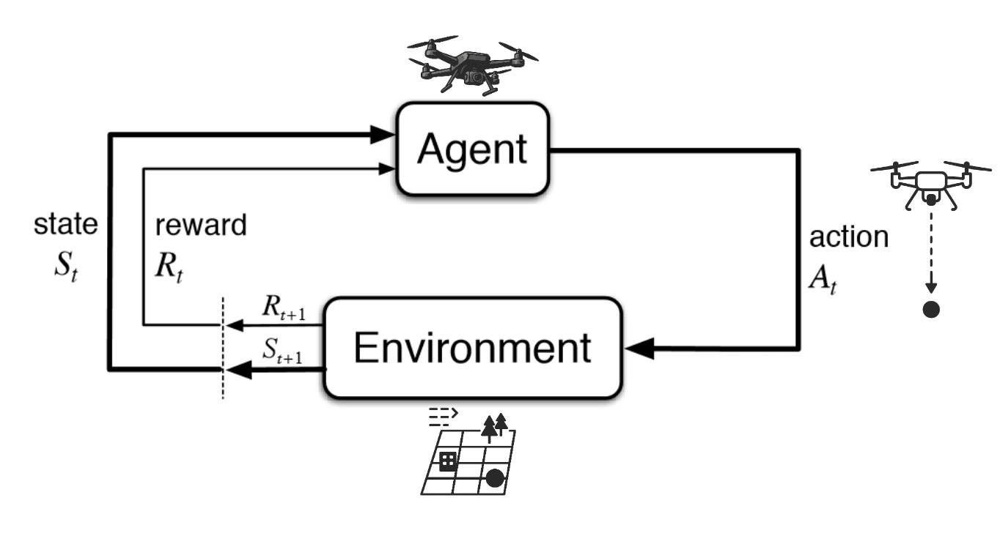

# Google Summer of Code 2025: SITL AI Reinforcement Learning Concept Script


> **A Lua script that lets ArduPilot learn to tune itself, live, within SITL.**

**Mentors:** Nate Mailhot & Sanket Sharma  |  **Timeframe:** May → Sep 2025  |  **Project:** [GSoC](https://summerofcode.withgoogle.com/programs/2025/projects/w7EYZSIz)

## 1. Introduction 📣

Hello ArduPilot community! I'm Bruno Andreoni Sarmento, a 4th‑year student at the Polytechnic School of the University of São Paulo (USP), pursuing a bachelor’s degree in Electrical Engineering. For the past two years I’ve been a member of Skyrats (USP’s autonomous‑drone team), where I’ve worked with many open‑source tools, ArduPilot being our core flight‑control framework.

I've been inspired by other team members that took part in GSoC projects, and it was a dream come true being selected for this awesome project!

## 2. Problem Statement ❗

Today, UAV parameter tuning still relies on manual adjustments, often requiring trial‑and‑error sweeps and test flights. This approach is:

* Time‑consuming and inefficient;
* Poorly reproducible;
* Not scalable for adaptive or autonomous systems.

Meanwhile, **Reinforcement Learning (RL)** offers a principled method for adaptive control, but the **ArduPilot SITL environment lacks built‑in support for episodic interactions**, which are essential for reliable training and evaluation.

## 3. Project Proposal 🚀

> This project builds a lightweight Lua‑based scripting layer on top of the existing SITL engine to enable episodic RL interactions.



The project introduces:

* **Episodic Replay** – a structured way to test and evaluate UAV behavior across multiple runs, starting from known or randomized states;
* **State Reset Mechanism** – using `sim:set_pose()` in Lua scripts to programmatically reset UAV position, velocity, and attitude between episodes;
* **Metric Logging** – automated telemetry collection (e.g., tracking error, convergence time) to evaluate each episode’s performance;
* **Offline RL Phase (baseline)** – log rich episodes and train an initial Q‑table/value‑function *offline* before any in‑place updates;
* **Online RL Phase (final goal)** – once the baseline is set, the same agent keeps learning *live*, updating parameters in real time during simulation.

This project builds the necessary infrastructure for **online learning directly in SITL**, unlocking new workflows for intelligent parameter tuning and experimental reinforcement learning within the ArduPilot ecosystem.

## 4. Solution Diagram 🖼️


### 4.1 Block‑by‑Block Breakdown 🔍

| Block                              | Role                                                                                                                                                                                                                                                    | Key ArduPilot / Lua APIs                                       |
| ---------------------------------- | ------------------------------------------------------------------------------------------------------------------------------------------------------------------------------------------------------------------------------------------------------- | -------------------------------------------------------------- |
| **Episode Manager**                | Detects episode termination (e.g. time‑out, crash, success) and fires a reset.                                                                                                                                                                          | `time:millis()`, custom state checks                           |
| **Teleport / Reset**               | Instantaneously re‑positions vehicle & zeros attitude/vel using **`sim:set_pose()`**.                                                                                                                                                                   | `sim:set_pose(instance, loc, orient, vel_bf, gyro)`            |
| **Metrics Collector**              | Computes reward signals (tracking error, overshoot, energy) every tick.                                                                                                                                                                                 | `ahrs:get_pitch()`, `vehicle:get_target_alt()`, custom math    |
| **Reinforcement Learning**                      | Updates Q‑table / value function in‑place at ≈ 10 Hz; selects next action. During the **Offline RL Phase** it runs in *log‑only* mode to gather state–action–reward traces for baseline training, switching to live updates in the **Online RL Phase**. | Pure Lua tables for Q‑table; math lib                          |
| **Policy Executor**                | Applies action by tweaking params or sending direct control:                                                                                                                                                                                            | `param:set("ATC_RAT_PIT_P", val)`, `vehicle:set_target_roll()` |
| **Direct State Feed (EKF Opt 10)** | Supplies fused state to Lua via binding helpers (`ahrs`, `ins`, etc.).                                                                                                                                                                                  | Firmware internal                                              |
| **Sensor Simulation**              | Generates IMU/GPS from physics backend (Gazebo or built‑in).                                                                                                                                                                                            | SITL C++                                                       |

## 5. How the Loop Runs 🔄

1. **Reset** → Script arms vehicle, immediately calls `sim:set_pose()` to starting state.
2. **Episode** → RL chooses an action (e.g., ±5 % on `ATC_RAT_RLL_P`).
3. **Flight** → Controller responds; Metrics Collector accumulates reward.
4. **Terminate** → After `N` steps or goal reached, Episode Manager logs result and triggers new reset.
5. **Learn** → RL updates its policy online before next episode begins.

Every tick is scheduled via `return loop, 100` (100 ms).

### 5.1 Code sketch 💻

```lua
-- init
local episode   = EpisodeManager.new{max_steps=200}
local policy    = QLearning.new{alpha=0.1, gamma=0.9, eps=0.2}
local collector = Metrics.new()

function loop()
  if episode:done() then
    sim:set_pose(0, episode.start_loc, episode.start_ori)
    policy:learn(collector:get())
    episode:reset()
    collector:clear()
  else
    local s = episode:get_state()
    local a = policy:select(s)
    PolicyExecutor.apply(a)
    collector:record(s, a)
  end
  return loop, 100 -- ms
end

return loop, 100
```

*(Full implementation lives in [https://github.com/b-andreoni/GSoC/blob/main/scripts](https://github.com/b-andreoni/GSoC/blob/main/scripts))*

---

## 6. Timeline 📅

This GSoC project is structured into five main phases:

| Phase                              | Timeframe                   | Key Deliverables                                                                                                          |
| ---------------------------------- | --------------------------- | ------------------------------------------------------------------------------------------------------------------------- |
| **1. Reset Mechanism**             | June 2025                   | • Integrate `sim:set_pose()` into SITL Lua API<br>• Enable repeatable episode resets                                      |
| **2. Offline RL Phase (baseline)** | late June – early July 2025 | • Collect episodic logs with a fixed policy<br>• Train baseline value/Q‑function offline<br>• Report baseline performance |
| **3. Online RL Loop**              | July 2025                   | • Implement reward & metrics collection<br>• Activate in‑place learning (SARSA/Q‑learning)                                |
| **4. Policy Refinement**           | August 2025                 | • Add exploration strategies (e.g., ε‑decay)<br>• Validate on varied flight scenarios                                     |
| **5. Docs & Releases**             | Early Sep 2025              | • Publish user guide and examples<br>• Open PRs/issues for community review                                               |

## 7. Call for Feedback 💬

I’d love to hear your field‑tested wisdom, war stories, and wish‑list items:

* **Reset mechanics** – any EKF glitches, timing tricks, or failsafes you’ve hit when using `sim:set_pose()`?
* **Practical benefits** – where could an in‑sim offline+online RL loop spare you manual PID sweeps or repetitive test flights?

Drop a comment on the PR, open an issue, or ping me on Discord (@bruno\_as). Your input will directly shape the next commits.

Thanks in advance!

## 8. GitHub 🔗

[https://github.com/b-andreoni/GSoC/](https://github.com/b-andreoni/GSoC/)

### Related PRs & Code Snippets

* [https://github.com/ArduPilot/ardupilot/pull/29616](https://github.com/ArduPilot/ardupilot/pull/29616)
* [https://github.com/ArduPilot/ardupilot/blob/master/libraries/AP\_Scripting/examples/sim\_arming\_pos.lua](https://github.com/ArduPilot/ardupilot/blob/master/libraries/AP_Scripting/examples/sim_arming_pos.lua)
* [https://github.com/ArduPilot/ardupilot/pull/29498/commits/51364c7f43af09c5f42d3e95315dc9c642dc093c](https://github.com/ArduPilot/ardupilot/pull/29498/commits/51364c7f43af09c5f42d3e95315dc9c642dc093c)
