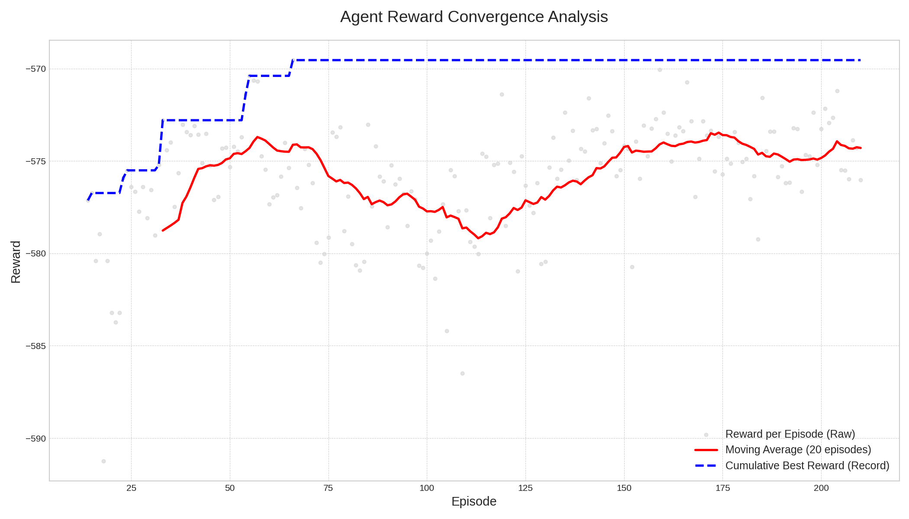

# GSoC 2025 Wrap-Up: Teaching ArduPilot to Learn in SITL

Hello ArduPilot community!

As the Google Summer of Code 2025 comes to a close, I'm thrilled to share the final results of the **SITL AI Reinforcement Learning Concept Script** project. What started as an ambitious proposal (to build a framework allowing ArduPilot to tune itself using Reinforcement Learning (RL) directly within SITL) has culminated in two successful, practical demonstrations for both Copter and Plane.

This project successfully built a lightweight, Lua-based scripting layer that enables the episodic interactions essential for RL, opening the door for a new class of intelligent, self-tuning algorithms within the ArduPilot ecosystem.

---

## Key Achievements

* **Enabling Absolute State Resets in SITL:** A critical achievement was contributing a targeted patch to the ArduPilot codebase ([PR #30982](https://github.com/ArduPilot/ardupilot/pull/30982)). The PR modifies `sim:set_pose()` to allow setting an absolute global position as the new origin, rather than one relative to offsets. This capability is essential for automation, as it's the way found to guarantee a consistent starting state for iterative learning algorithms.
* **Episodic Reset Framework:** Using this new core function, we implemented a robust scripting layer that can reliably reset the vehicle's state between training episodes, a cornerstone for any RL task.
* **Practical RL Agents:** Developed and successfully trained Q-learning agents to solve complex, real-world tuning problems.
* **Demonstrated Success on Copter and Plane:** Achieved tangible, impressive results on two different vehicle types, proving the versatility of the framework.

---

## Result 1: Copter Energy-Optimal Path Planning

<table>
  <tr>
    <td></td>
    <td></td>
  </tr>
</table>

One of the most exciting results came from teaching a Copter to find the most energy-efficient path to visit 50 waypoints.

**The Challenge:** Find the shortest route that consumes the least amount of battery.

**The Agent's Solution:** After approximately 3,000 training episodes, the agent's policy converged. Instead of a simple outside-in path, it discovered a sophisticated strategy: it first visits the outer waypoints in an efficient spiral and then handles the more tightly-packed inner waypoints. As my mentor Nate noted, it learned that the "cost" of visiting the inner points was lower, allowing for a more random-looking but ultimately optimal path in the center.

**
*The final, energy-optimized path after ~3000 learning episodes. The agent discovered an intelligent spiral strategy.*

The learning process is clearly visible in the reward evolution. The agent begins by exploring random, high-energy paths and gradually converges on a low-energy, stable solution.

**
*Energy consumption per episode over time. The green line shows the progressive discovery of better, lower-energy paths.*

---

## Result 2: Plane TECS Auto-Tuning

For fixed-wing aircraft, we tackled one of the most complex manual tuning tasks: the Total Energy Control System (TECS).

**The Challenge**: Find the optimal combination of `TECS_SPDWEIGHT`, `TECS_TIME_CONST`, and `TECS_PTCH_DAMP` for each unique airframe to achieve smooth and efficient control during a dynamic flight maneuver.

**The Agent's Solution**: Each agent flew a challenging "pitch cresting" maneuver repeatedly. The results reveal a fascinating insight into the agent's adaptability:

* For the **Default Plane**, the agent converged on the parameters `{S:1, T:4.0, P:0.3}`, achieving a best reward of **-569.54**. This represents a strategy with a relatively fast time constant and low pitch damping.
* For the more aerobatic **`plane-3d` model**, the agent found a completely different optimal strategy: `{S:1, T:7.0, P:0.9}`, with a nearly identical best reward of **-569.97**. This tune uses a much slower time constant and higher damping.

**Why This Is So Important**: It shows that while the maximum performance achievable by both planes in this maneuver was almost the same, the **strategy required to get there was fundamentally different**. The agent correctly learned that the `plane-3d` model required a slower, more damped response to fly optimally compared to the default plane.

This proves that the system isn't just finding a generic solution. It's sensitive to the subtle, unique flight dynamics of an airframe and finds the specific balance of parameters that works best for it—exactly what an expert human tuner aims to do.

---

## Future Work

This project successfully demonstrated the viability of RL-based tuning in SITL. The framework is designed for extension, and future work will focus on three key areas:

1.  **Generalization:** Evolve the example scripts into a more generalized framework. This will allow users to target any parameter set and define custom flight scenarios and reward functions with minimal code changes.

2.  **Diversification:** Increase the variety of RL tuning scripts to cover other vehicle types (Rover, Sub) and more complex control loops, such as attitude controllers and navigation filters.

3.  **Validation:** Develop standardized procedures for validating and transferring the optimized gains from the simulator to real-world vehicles, ensuring that the performance improvements translate effectively.

---

## Final Thanks

This project would not have been possible without the incredible guidance and support of my mentors, Nate Mailhot (@NDev) and Sanket Sharma (@snktshrma). Your technical insights and constant encouragement were invaluable.

A huge thank you to the entire ArduPilot community for creating a welcoming open-source ecosystem. It has been an honor to contribute, and I look forward to seeing how these tools are used and expanded upon in the future!

## Project Resources:

* **Main GSoC Repository:** [https://github.com/b-andreoni/GSoC](https://github.com/b-andreoni/GSoC)
* **Initial Project Blog Post:** [https://discuss.ardupilot.org/t/gsoc-2025-sitl-ai-reinforcement-learning-concept-script/135423](https://discuss.ardupilot.org/t/gsoc-2025-sitl-ai-reinforcement-learning-concept-script/135423)
* **Mid-Term Update:** [https://discuss.ardupilot.org/t/gsoc-2025-sitl-ai-reinforcement-learning-concept-script/135423/3#p-537071-mid-term-project-update-1](https://discuss.ardupilot.org/t/gsoc-2025-sitl-ai-reinforcement-learning-concept-script/135423/3#p-537071-mid-term-project-update-1)

Thank you for a fantastic summer!